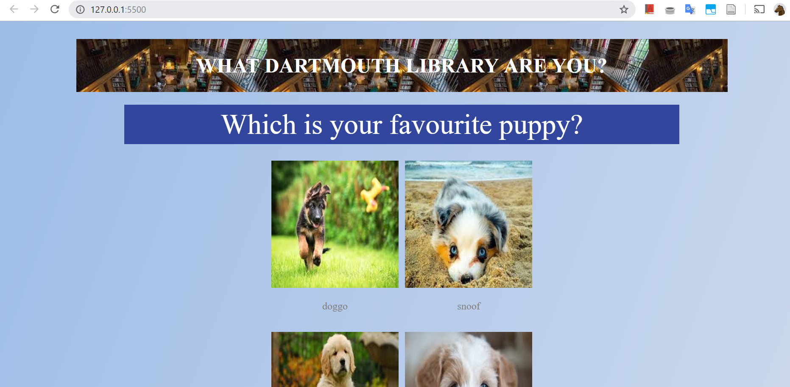
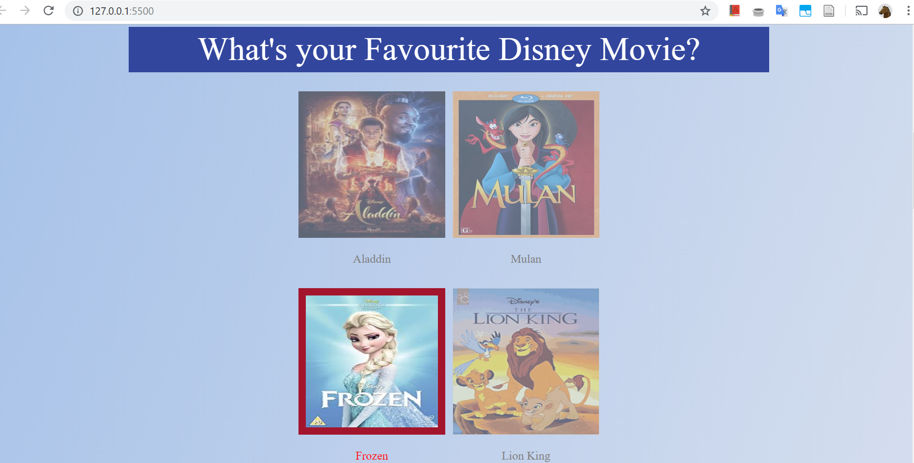
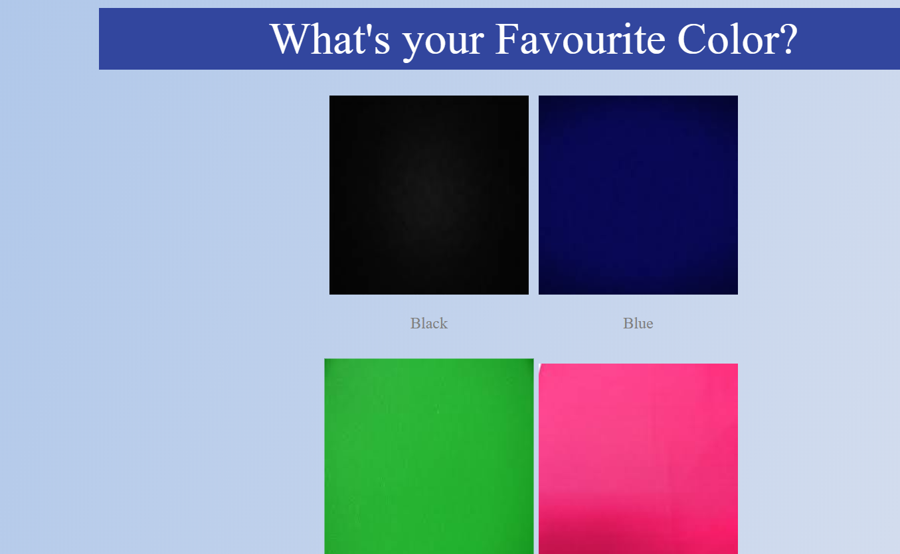
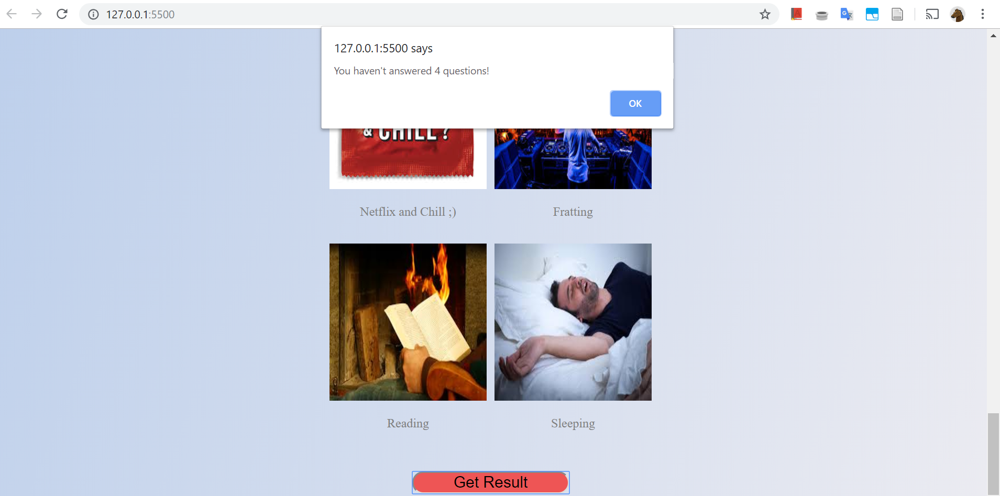
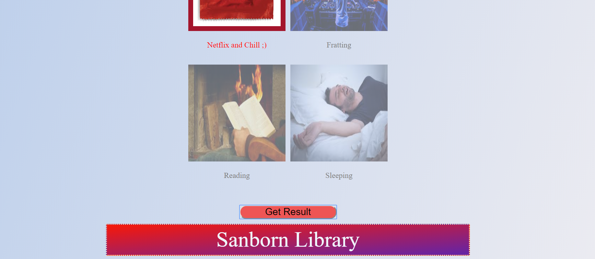

# lab2-akapur99
lab2-akapur99 created by GitHub Classroom

# Abhi's Quiz

It's a chill quiz. I did the JSON and also did half the CSS part for Extra Credit. 

## Things I want to point out:
* The [alert] if all not filled out will adjust if you add questions to the JSON data
* Animation and scroll effect for the displaying of the result
* Hover effects for the answers
* Animation/Effects when you click on an answer
* Use of Linear Gradients for background and for 'result'
* Complex Scoring
* Responsive (Mobile)

## Screen Caps

